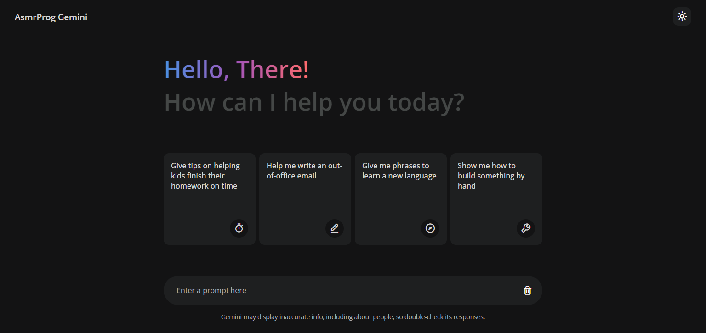

# Google-Gemini-Clone
I built a Generative AI app, just like Google Gemini or ChatGPT, using vanilla JavaScript as a practice project.

I created this Gemini clone app using the Gemini API for free. 

・AI-Powered Chat Core: I created a generative AI app similar to Google Gemini or ChatGPT using vanilla JavaScript. 🤖
・Gemini API Integration: I connected to and used the Gemini API to add AI capabilities, enabling natural language conversations and responses in the app. 🌐
・Full JavaScript Implementation: I set up the project and implemented all AI-powered chat features using vanilla JavaScript. 💻
・User-Friendly Interface: I designed a sleek, responsive interface, achieving an engaging chat experience with smooth, real-time responses. 🌟
・Performance Optimization: I ensured the AI chat app is efficient and runs smoothly across different devices and platforms. 📱

# Warning
You need to get your own API Key (in video we showed how!) and replace it in script.js file on line 12 :
```
const GOOGLE_API_KEY = "YOUR_API_KEY";
```

# Screenshot
Here we have project screenshot :
